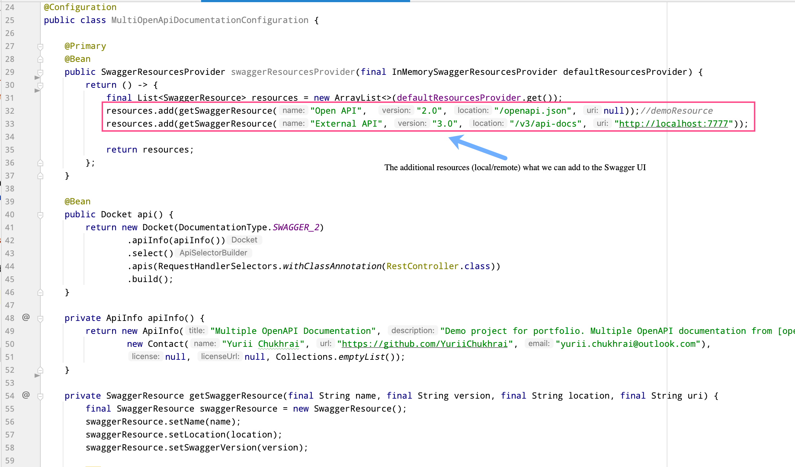
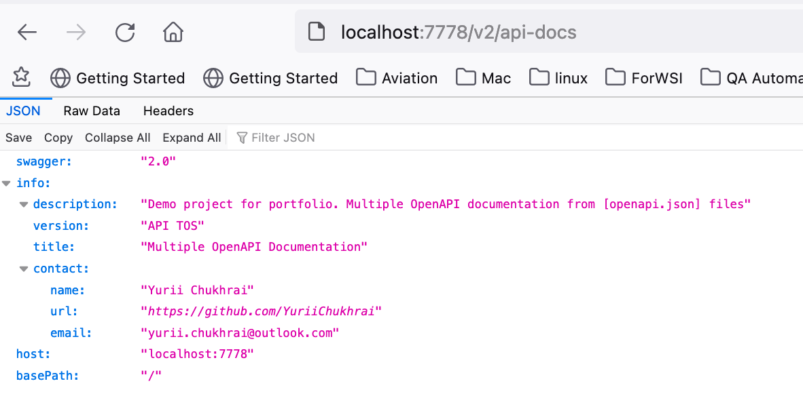
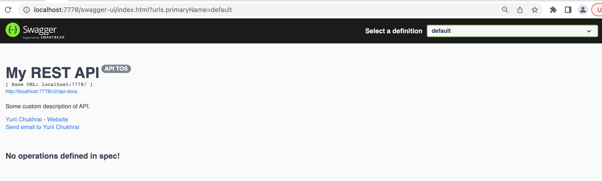

# http-status-codes

## Dependencies
Make sure you have installed on your operating system: 
1. [JDK. Oracle](http://www.java.com/) OR [OpenJDK](https://openjdk.java.net/)
2. [Git](https://git-scm.com/)
3. [Maven](https://maven.apache.org/)

## Swagger UI
In your example the documentation will be available by next URL's: 
- http://localhost:7778/v2/api-docs - OpenAPI JSON. Information about the current project.  
- http://localhost:7778/swagger-ui/index.html - Swagger UI for different definitions (and external OpenAPI JSON (`src/main/resources/public/openapi.json`) too)

**Swagger:** http://server:port/context-path/swagger-ui.html 
**OpenAPI:** http://server:port/context-path/v3/api-docs

## 2.0 Running

### Run using Maven

`$> mvn clean spring-boot:run -Dspring-boot.run.profiles=[{provile: local, dev, prod}]` 
OR 
`$> mvn spring-boot:run -Dspring-boot.run.profiles=local,prod`

### Run using JAR
`$> mvn clean package -Dmaven.test.skip=true` - generate JAR artifact 
`$> java -Dspring.profiles.active=local,prod -jar ./target/multi-openapi-documentation.jar` - run service 

## TBD
Add online integration from external running services.

___

## Intro

### 1 Documentation

####  1.1 SpringFox
Springfox is a framework that acts as the “glue” between Swagger and Spring. 
It generates the specification (contract) based on your code and also deploys 
the Swagger UI client with your application, allowing you to immediately test your REST API.

####  1.2 Open API

The ability of APIs to describe their own structure is the root of all
awesomeness in OpenAPI. Once written, an OpenAPI specification and
Swagger tools can drive your API development further in various ways.

**_Pic#1_**. Spring Boot configuration Bean for OpenAPI/Swagger documentation

On the line 32 we are reading information about some of API from JSON file. 
You can have multiple files related to the different projects, and they will be available in Swagger UI.
To generate **openapi.json** from Postam collections you can use these two projects:
 * [postman-to-openapi](https://joolfe.github.io/postman-to-openapi/)
 * [Postman2OpenAPI](https://github.com/kevinswiber/postman2openapi)

We can simply access the Open API documentation at:

***URL (JSON):** http://localhost:7778/v2/api-docs*

**In our case we do not have any REST controllers, so It will be contact info only :)**

**_Pic#2_**. OpenAPI documentation JSON (it's how Mozilla parse JSON by
default)

###  1.3 Swagger UI

Swagger is a set of open-source tools built around the OpenAPI
Specification that can help you design, build, document and consume REST
APIs. Swagger UI - renders OpenAPI specs as interactive API
documentation. Use Swagger UI to generate interactive API documentation
that lets your users try out the API calls directly in the browser.

*URL: http://localhost:7778/swagger-ui/index.html*

**_Pic#3_**. Swagger UI. Default project (contact information only)

**_Pic#4_**. Swagger UI. Uploaded project API information from `src/main/resources/public/openapi.json`

## References
* [SwaggerResourceConfig.kt](https://gist.github.com/brunapereira/52033b00a81ad885a60c2950eb371fb3#file-swaggerresourceconfig-kt)
* [Remove Basic Error Controller In SpringFox Swagger-UI](https://www.baeldung.com/spring-swagger-remove-error-controller)
* [Spring Doc](https://springdoc.org/#Introduction)
* [Swagger](https://swagger.io/docs/specification/about)
* [OpenAPI Specifications](https://medium.com/creditas-tech/open-api-specifications-with-your-api-rest-spring-boot-17951e9c22a0)
* [Spring Fox GitHub](https://github.com/springfox/springfox)
* [postman-to-openapi](https://joolfe.github.io/postman-to-openapi/)
* [Postman2OpenAPI](https://github.com/kevinswiber/postman2openapi)
* [SpringFox](https://dimitr.im/documenting-rest-api-swagger-springfox)

